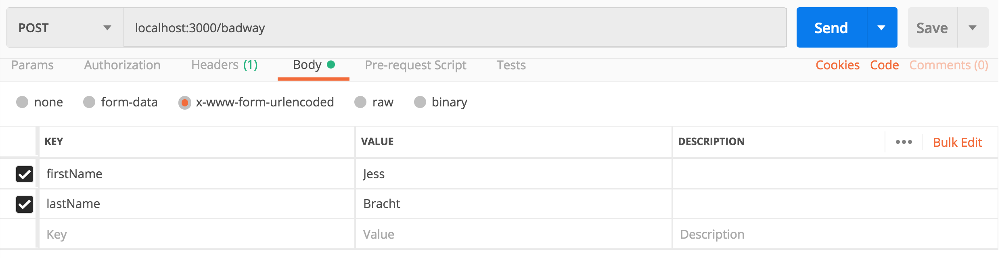

# body-parser-demo
What is body parsing middleware even doing anyway??

This is a demo of what might happen if we **didn't** have a body parser, and then an example of the lovely world where we **do** have one.

## That's nice how do I run this code
Glad you asked:

`npm install` to, uh, install stuff we need

`npm start` to, uh, start the thing

## K now what, how do I use it
Great questions. You're gonna wanna hit those routes, so we can use something like [Postman](https://www.getpostman.com/downloads/) to simulate making all kinds requests to our server. Let's start by hitting the route for `POST /badway` (PS these are POST routes because those usually have a body that we'd wanna do something with):

Now go check your server console. You should see a log of the body we had to parse manually.

You can use Postman to make another request, this time to `POST /goodway` to hit the other route. Again, check the console, and you'll see the body object.

## Both my POST requests printed the same thing, what's the difference
You're **right**!! Go check out the code for each route. You'll see in the `/badway` route, we had to do a **lot** more work to get the body object to look nice and usable. However, in the `/goodway` route, it's **way** simpler. I tried to leave lots o' comments explaining what the heck is going on with the code. Hopefully this helps explain a little bit of what body parser middlewares are doing, and why we want/need them :)
